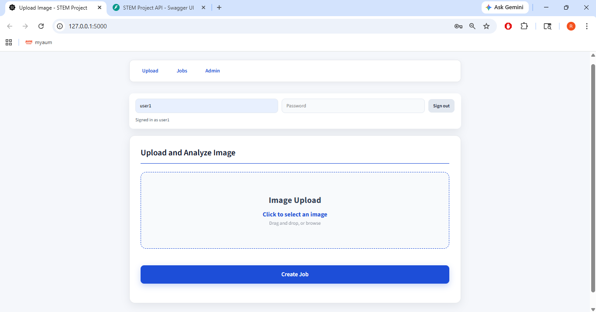
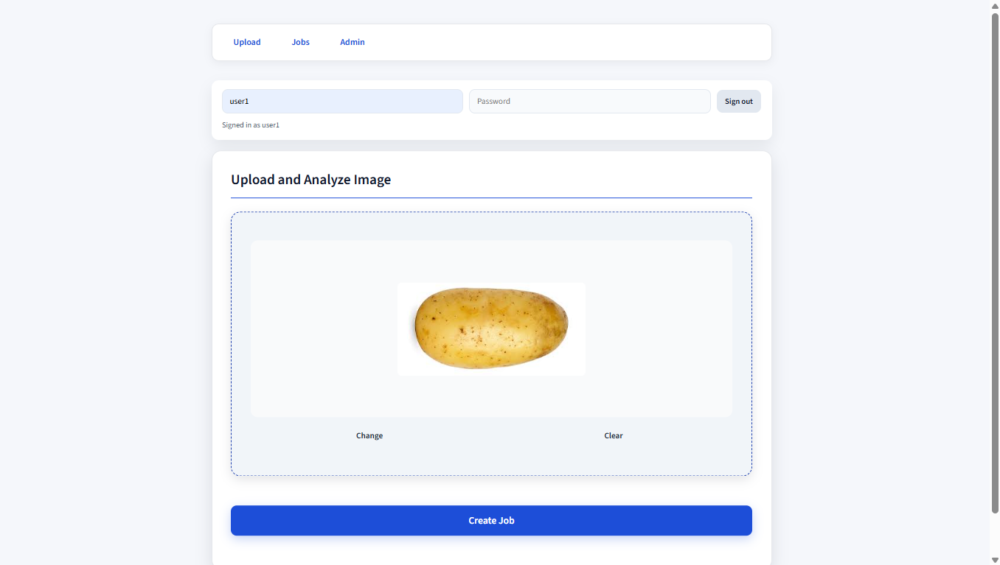
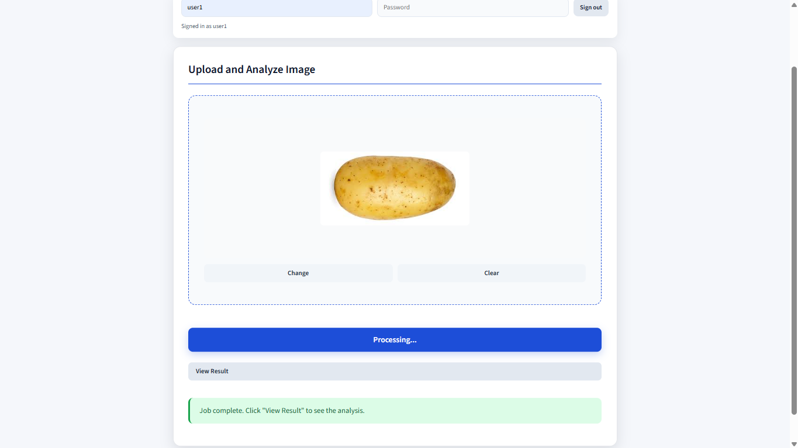
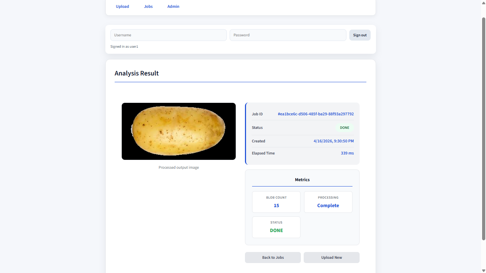
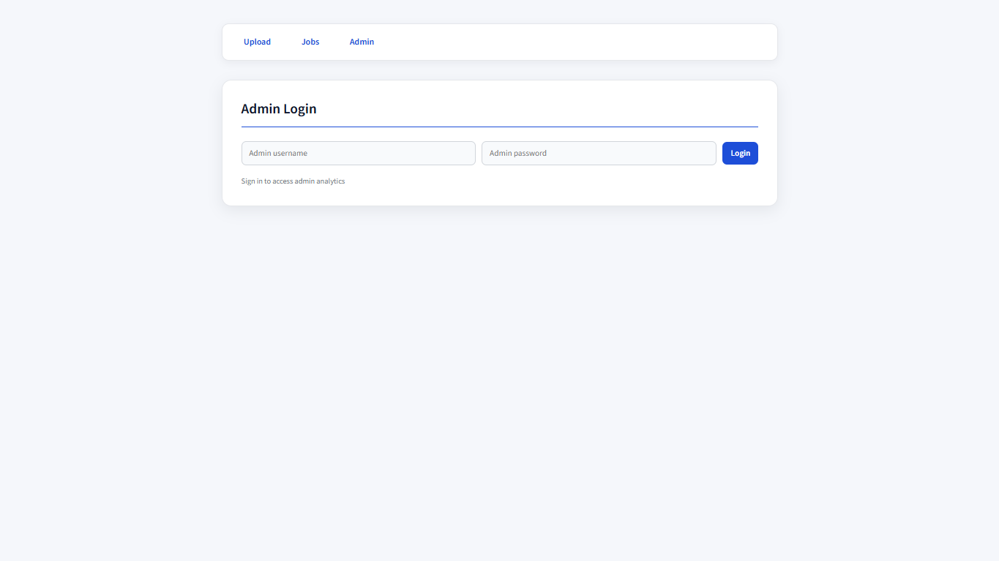
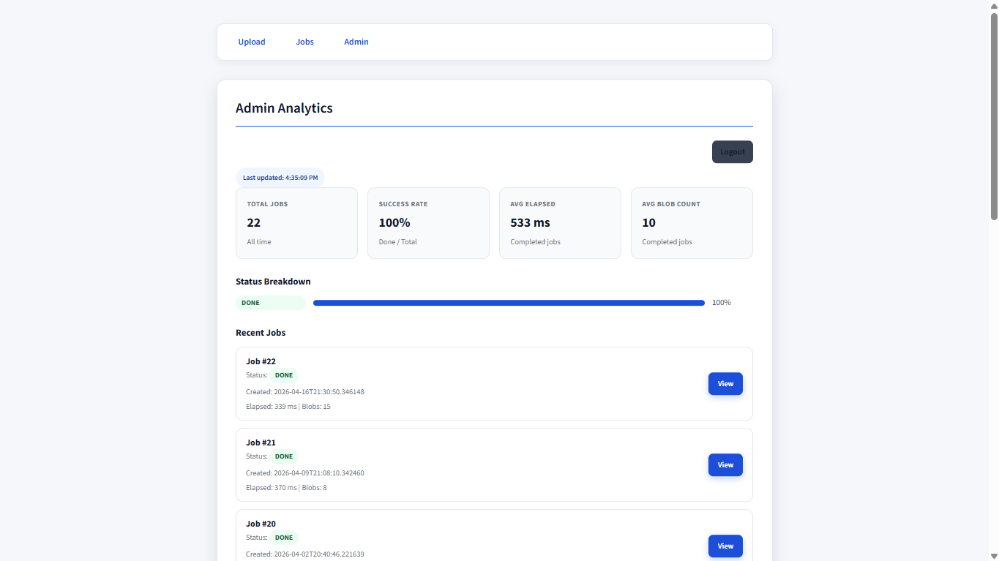
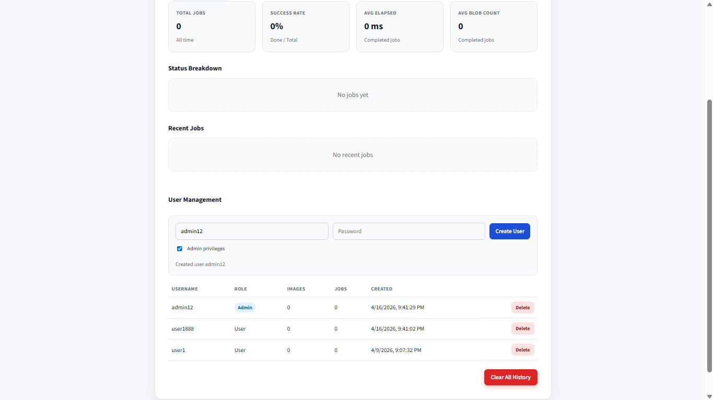
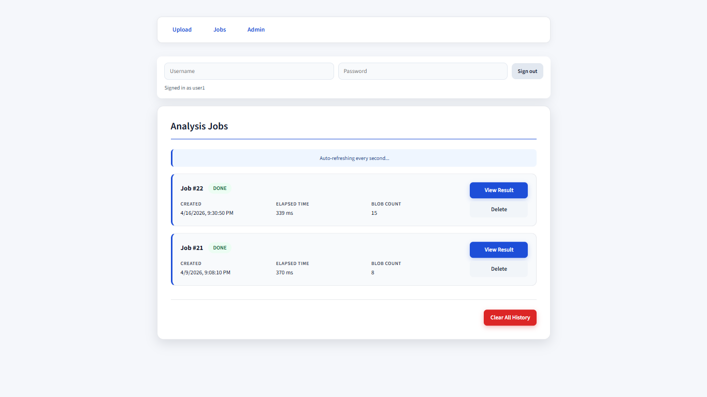
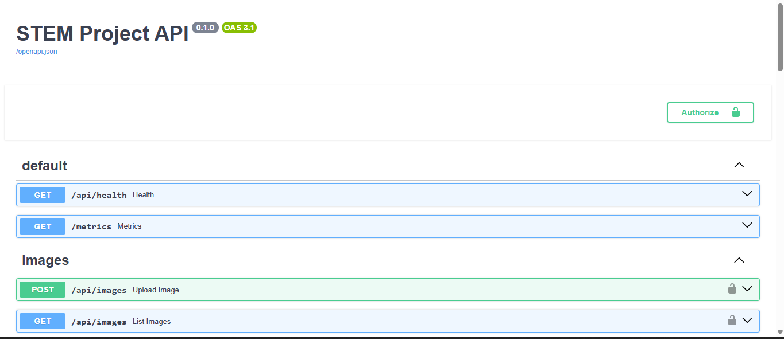
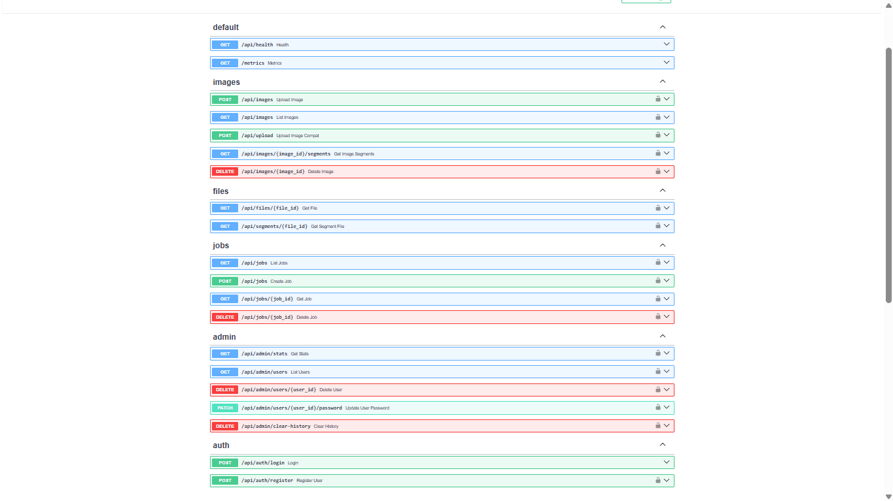

# Image Analysis and Segmentation Platform

This program is a FastAPI-based image upload and analysis app with a browser frontend, background job processing, per-user access control, and automatic segmentation outputs generated at upload time.

The app serves the frontend and API from the same FastAPI server, stores metadata in SQLite, saves files on disk, and exposes admin tools for analytics and user management.

## Why This Project Matters

This project was built to demonstrate end-to-end engineering across frontend workflow design, backend API development, secure file handling, user and admin authentication, and lightweight computer vision. Instead of stopping at a prototype, it grew into a more complete platform that shows how interface design, storage, background processing, access control, and segmentation features can work together in one system.

## Skill Highlights

- Built a full-stack FastAPI and vanilla JavaScript workflow for image upload, job creation, result tracking, and admin operations
- Added authentication, role-based access control, and ownership-aware file and job permissions for admin and regular users
- Implemented a lightweight image segmentation pipeline with generated foreground, background, and mask artifacts
- Designed admin analytics, user management, and API-backed operational tooling for a multi-user workflow

## Project Highlights

- Built a full-stack image workflow with uploads, background jobs, result tracking, and admin tooling
- Added authenticated admin and user access with ownership-aware file and job controls
- Implemented lightweight automatic segmentation with generated foreground, background, and mask artifacts
- Documented the project evolution in [`report.md`](report.md)

## Screenshots

### Upload Flow

Step 1: signed-in upload screen



Step 2: image selected and previewed before submission



Step 3: job completed and ready to view results



Step 4: final analysis result page with output and metrics



### Admin Login



### Admin Analytics



### User Management



### User Job History

User history page showing previously requested analysis jobs, timing data, and quick access to result views.



### API Documentation





## Features

- Upload images through the web UI or API.
- Automatically generate segmentation artifacts for each upload.
- Create background jobs tied to uploaded images.
- Restrict images, jobs, and files to their owning user, with admin override.
- Manage users from the admin UI or admin API.
- View admin stats and Prometheus-style metrics.
- Run locally with a lightweight FastAPI + SQLite stack.

## Tech Stack

- Backend: FastAPI, SQLModel, SQLite
- Frontend: static HTML, CSS, and JavaScript
- Image processing: Pillow, NumPy, scikit-image
- Observability: structured request logging and `/metrics`
- Optional local HTTPS: Caddy

## How It Works

1. A signed-in user uploads an image.
2. The backend validates the file and stores it under that user's data directory.
3. The upload is classified and, when supported, segmentation outputs are written automatically.
4. The frontend creates a job for the uploaded image.
5. A background task processes the job and stores output metadata for the Result and Admin pages.

## Project Structure

```text
backend/
  app/
    api/routes/       FastAPI route handlers
    db/               database setup
    models/           SQLModel models
    schemas/          request/response models
    services/         job, storage, and segmentation logic
  scripts/            helper scripts
frontend/
  *.html              app pages
  js/                 frontend logic
  Assets/css/         styling
README.md
Caddyfile
startup_guide.md
```

## Quick Start

### Requirements

- Python 3.12
- `pip`
- PowerShell on Windows
- Caddy if you want local HTTPS

### Backend

```powershell
cd backend
if (!(Test-Path .env)) { Copy-Item .env.example .env }
if (!(Test-Path .venv)) { python -m venv .venv }
.\.venv\Scripts\activate
pip install -r requirements.txt
uvicorn app.main:app --reload --host 0.0.0.0 --port 5000
```

Open the app at `http://localhost:5000/index.html`.

Open the API docs at `http://localhost:5000/docs`.

### Optional HTTPS with Caddy

```powershell
caddy run --config Caddyfile
```

If `caddy` is not on your `PATH`, use the full path to your local `caddy.exe`.

If Caddy is running, use `https://localhost/index.html` and `https://localhost/docs`.

## Configuration

Environment variables are loaded from `backend/.env` when present.

Common settings:

- `APP_HOST` and `APP_PORT`: server bind settings
- `APP_ENV`: environment name; non-development mode applies stronger security checks
- `CORS_ORIGINS`: comma-separated allowlist
- `ADMIN_USERNAME`: default admin username
- `ADMIN_PASSWORD` or `ADMIN_PASSWORD_HASH`: admin credentials
- `JWT_SECRET`: signing secret for auth tokens
- `JWT_EXPIRE_MINUTES`: token lifetime
- `UPLOAD_MAX_BYTES`: upload size limit
- `UPLOAD_ALLOWED_CONTENT_TYPES`: allowed MIME types
- `UPLOAD_ALLOWED_EXTENSIONS`: allowed file extensions
- `IMAGE_CLASSIFIER_PROVIDER`: image classification mode, including `light`

Example:

```env
APP_HOST=0.0.0.0
APP_PORT=5000
APP_ENV=development
ADMIN_USERNAME=admin
ADMIN_PASSWORD=change-this-password
JWT_SECRET=change-this-secret
JWT_EXPIRE_MINUTES=60
IMAGE_CLASSIFIER_PROVIDER=light
```

To generate a hashed admin password:

```powershell
cd backend
.\.venv\Scripts\activate
python scripts\generate_admin_password_hash.py
```

## Authentication and Roles

- All upload, image, job, and file operations require an authenticated user.
- Admins can access all users' images and jobs.
- Regular users can only access their own images, jobs, and derived files.
- The frontend supports user login on the Upload, Jobs, and Result pages.
- Admin functionality is available from `admin.html` and protected admin API routes.

## API Overview

### Health and Metrics

- `GET /api/health`
- `GET /metrics`

### Auth

- `POST /api/auth/login`
- `POST /api/auth/register` (admin only)

### Images

- `POST /api/images`
- `POST /api/upload` (compatibility alias)
- `GET /api/images`
- `GET /api/images/{image_id}/segments`
- `DELETE /api/images/{image_id}`
- `GET /api/files/{file_id}`

### Jobs

- `POST /api/jobs`
- `GET /api/jobs`
- `GET /api/jobs/{job_id}`
- `DELETE /api/jobs/{job_id}`

### Admin

- `GET /api/admin/stats`
- `GET /api/admin/users`
- `PATCH /api/admin/users/{user_id}/password`
- `DELETE /api/admin/users/{user_id}`
- `DELETE /api/admin/clear-history`

## Segmentation Outputs

When the lightweight classifier path is enabled, uploads can generate:

- original image URL
- foreground image
- background image
- binary mask image

These are exposed through `GET /api/images/{image_id}/segments` when available.

## Data Storage

- SQLite database: `backend/data/app.db`
- User-owned files: `backend/data/users/<user_id>/...`
- Additional generated outputs: `backend/data/outputs`

## Future Improvements

The current version is a strong single-machine or controlled-environment project, but it also leaves clear room for growth. The next most meaningful improvements would be stronger automated testing, a more production-ready worker architecture, broader segmentation validation, and smoother UX around long-running jobs and deployment operations.

## Roadmap

- Add automated tests for authentication, uploads, segmentation outputs, and job flows
- Add CI to run tests on every push and pull request
- Move background jobs from in-process tasks to a persistent worker queue
- Improve segmentation accuracy with more sample images and tuned fallback rules
- Improve frontend error states, loading states, and job-status feedback
- Document deployment, environment setup, and backup/recovery steps
